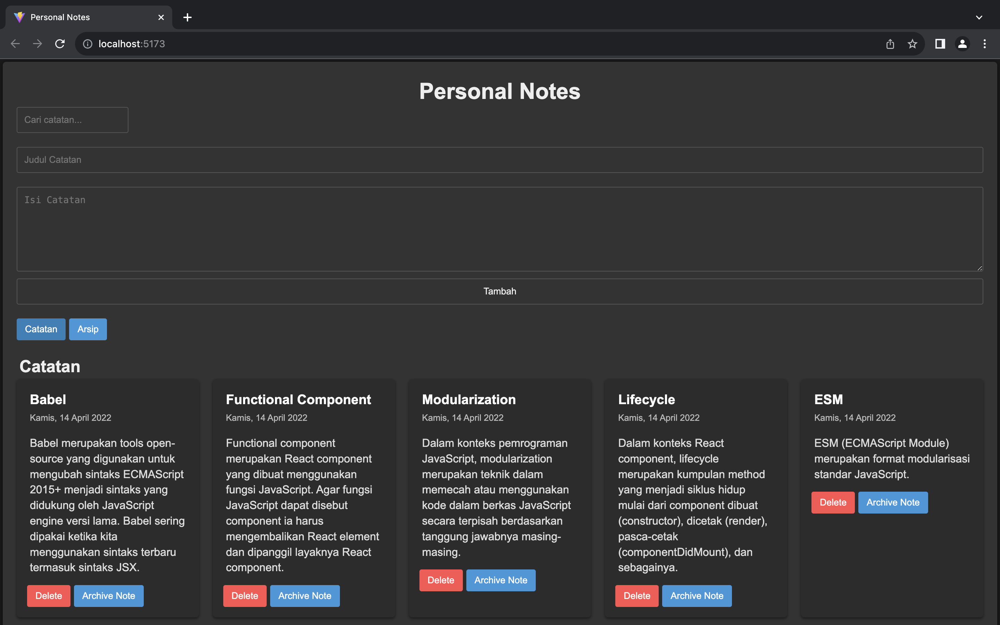

# Personal Notes

Building a personal notes with React is an engaging project designed to help users organize their thoughts and tasks efficiently. 

## Screenshots




## Run Locally

Clone the project

```bash
  git clone https://github.com/lokajaya1/personal-notes.git
```

Go to the project directory

```bash
  cd personal-notes
```

Install dependencies

```bash
  npm install
```

Start the server

```bash
  npm run start
```

